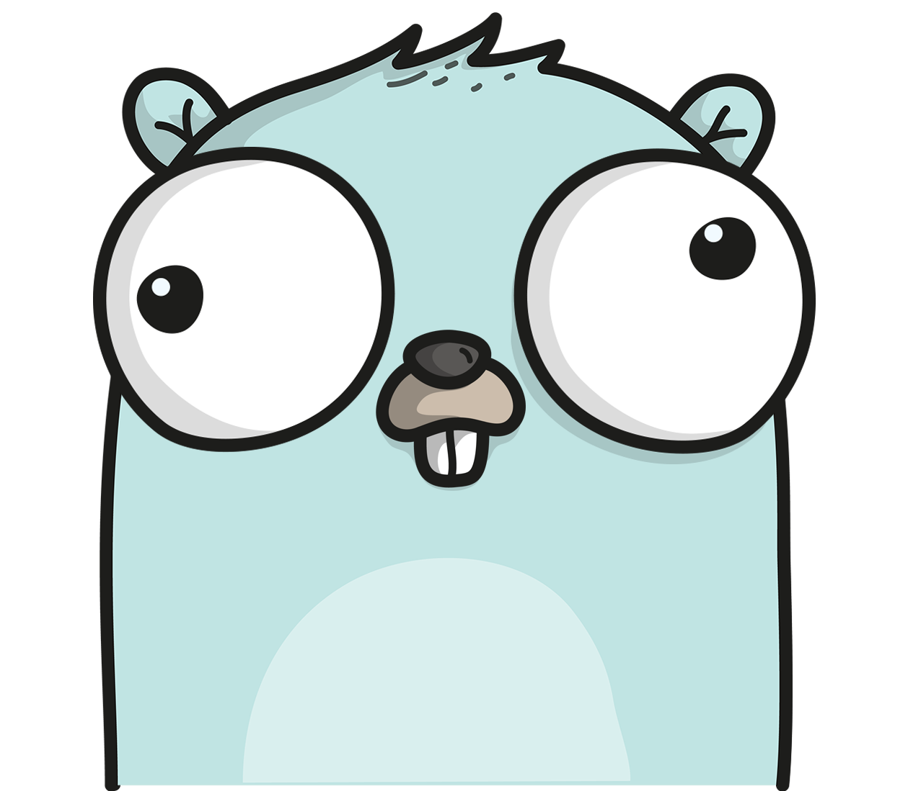

# Desktop Profiles

App & website launcher
Create any number of profiles to open any combination of your frequently used apps and websites from the cli at once! 

** Follow the instructions below to get started ** 

Note: This was built in Go on a Mac (for a Mac)

************************************************************************************************

## :floppy_disk: Install:

0. Install go and configure your GOPATH - here are some quick [instructions](https://medium.com/@jimkang/install-go-on-mac-with-homebrew-5fa421fc55f5) and here are some detailed [instructions](https://www.digitalocean.com/community/tutorial_series/how-to-install-and-set-up-a-local-programming-environment-for-go)

1. Download / clone this repo. Then 'cd' into it.

2. Run `go run desk.go` -> this will walk you through creating your app directory file

3. You're ready to roll! Checkout the commands and walk through the example below

4. For a list of the available flags, type `go run desk.go -help`

## :earth_africa: Install as an Executable: 
Do this to access the app from anywhere and have an easier command

1. Once you download this repo, cd into it and type `go build`. This will create a binary file called desk. 

2. Go to these [instructions](https://www.digitalocean.com/community/tutorial_series/how-to-install-and-set-up-a-local-programming-environment-for-go), and in that link go through step 5 to make sure your GOPATH in the ~/.bash_profile is created properly. 

3. Make sure you're directly inside this DesktopProfiles directory you downloaded. Now we add the executable to your bin file with the command `go install`

4. You should have access to this executable globally - instead of typing `go run main.go` before all your commands, just type `desk` instead! 

## :mega: Commands:

* When you download the package, run `go run desk.go`, this will give you instructions on providing the routes to the Applications folders you want to be able to access using this app
    - 3 of the most common routes for locations of Applications on Mac are shown at the bottom, just copy and paste those -> don't forget to change {USER-NAME} to your computer user name, then type `done`
    - Don't worry, if you download new apps or find out you want to add more paths to Applications folders later - just delete the appDir file and run `go run desk.go`, now re-add all the paths you'd like to include

* List of input options: `go run desk.go -help`

* List available profiles: `go run desk.go` 

* List contents of a profile: `go run desk.go -pf profile-name -l y -o n` (this means the list flag is set to yes, and open flag set to no)

* Open a profile:  `go run desk.go -pf profile-name` 

* Create a profile, type the name of the profile and the app or url you'd like to add:  `go run desk.go -pf profile-name -add app`. Replace `app` with `url` if you want to add urls. Then type done and hit enter when you're finished.

* Add to an existing profile: `go run desk.go -pf profile-name -add app`. Replace `app` with `url` if you want to add urls. Then type done and hit enter when you're finished.

* Delete from profile:  `go run desk.go -pf profile-name -del url`. Replace `app` with `url` if you want to add urls. Then type done and hit enter when you're finished.

* Delete profile:  `go run desk.go -pf profile-name -del profile-name`

## :goal_net: Example:

An example profile has been provided in the profiles/ folder.
All your profiles can be found in this folder as well. 

To run the example, type:
`go run desk.go -pf example`

### To add an app (Slack) to the example, type:
`go run desk.go -pf example -add app`
Then type:
`Slack`
And hit Enter.

You've now added Slack to your profile, type the name of any other apps you'd like in this profile and hit enter after each one. 

Then type:
`done`
and hit Enter when you've finished. 

### To add a website (Google) to the example, type:
`go run desk.go -pf example -add url`
and hit Enter.

Now, type:
`google.com`
And hit Enter.

You've now added google.com, type the name of any other websites you'd like and hit enter after each one. 

And finally:
`done`
when you're finished. 

### To delete an app or url, do the same as above for adding, except use the `-del` flag instead of `-add`

### To delete a profile:
`go run desk.go -pf profile-name -del profile-name`

You should get a confirmation message after making changes to any profile. 

## :warning: IMPORTANT:

### Input: 

* No trailing spaces when adding or deleting apps. Must be typed exactly as is in the appDir.txt

* Type anything for yes, type "no" for no, more details can be found about the input by typing the "-help" flag: go run desk.go -help (Exception: for -del flag when deleting a profile -> must be the profile name or "profile")

* Currently case sensitive - apps must be typed exactly as shown on your pc

* If you're having trouble specifying an app, find it in the appDir.txt file (which is created when you first run `go run desk.go`) and ignore the number in front of it")

### APP DIRECTORY:

* If you added more new apps to your pc, just delete the appDir file and a new one will be created for you next time you run the program.

Future updates:
- needs to handle trailing space when deleting apps
- need to be able to close apps and urls too

Open functionality help from:
https://github.com/skratchdot/open-golang

go doc
https://make-school-courses.github.io/BEW-2.5-Strongly-Typed-Languages/#/Lessons/DocsDeploy
