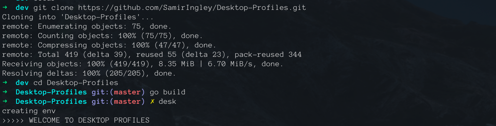
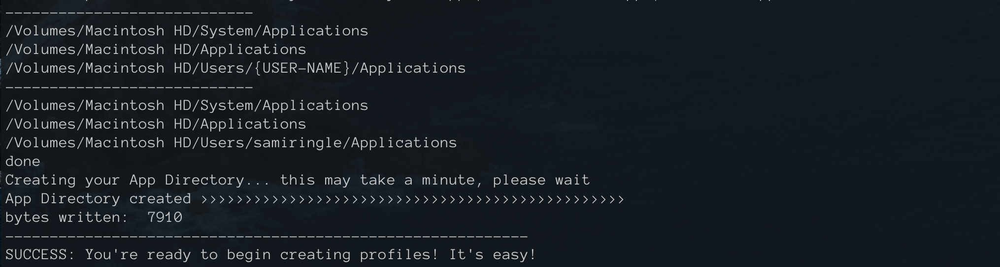

# Desktop Profiles 

App & website launcher: 
Create any number of profiles to open any combination of your frequently used apps and websites from the cli at once! 

### ** Instructions below ** 

Note: This was built in Go on a Mac (for a Mac)

************************************************************************************************

# :floppy_disk: Install:

### 0. Install go and configure your GOPATH
Here are some quick [instructions](https://medium.com/@jimkang/install-go-on-mac-with-homebrew-5fa421fc55f5) and here are some detailed [instructions]              (https://www.digitalocean.com/community/tutorial_series/how-to-install-and-set-up-a-local-programming-environment-for-go)

### 1. Download / clone this repo. 
Move it where you want, then 'cd' into it. 
:exclamation: IMPORTANT: If you move the folder after the next step, delete the .env and appDir.txt files and re run the command so it can recalibrate.

### 2. Run `go run desk.go`
This will walk you through creating your app directory file. Once you complete this step, you're done! The picture shows `go build` and `desk` -> checkout the "install as executable" steps for this more convenient command :)

* When you download the package, run `go run desk.go`, this will give you instructions on providing the routes to the Applications folders you want to be able to access using this app, if you've done the executable route just type `desk`

* 3 of the most common paths for locations of Applications on Mac are there shown at the bottom between the short lines, just like in the picture, copy and paste those -> don't forget to change {USER-NAME} to your computer user name, then type `done`

## :boom: Problems?? Errors?? - Need more paths?? Or apps??

If you run into ANY problems with opening apps, you've downloaded new apps, or added incorrect paths while setting up, or you move your folder:
-> Delete the appDir.txt, delete the .env file, and if you did `go build` - also delete the binary file `desk` but NOT `desk.go` 
-> Re run the program `go run desk.go` or `go build` > `desk` and you'll be prompted to set it up again :) follow the pictures carefully

Feel free to reach out to me if you run into any issues: samir.ingle7@gmail.com

## :earth_africa: Install as an Executable: 
This makes command to access the app shortened to just `desk` instead of `go run desk.go` :) but you can only use it locally (inside the directory) - I haven't been able to configure it for `go install` ... yet

NOTE: you can do this before or after you've setup the app with `go run desk.go`. If you plan on moving this folder to a more convenient spot, delete the .env and appDir.txt file 

### 0. Make sure your GOPATH is configured correctly 
Here are some quick [instructions](https://medium.com/@jimkang/install-go-on-mac-with-homebrew-5fa421fc55f5) and here are some detailed [instructions](https://www.digitalocean.com/community/tutorial_series/how-to-install-and-set-up-a-local-programming-environment-for-go) 

### 1. Type `go build`.
This will create a binary file called desk.

### 2.  Type `desk` instead of `go run desk.go`! 
Type `desk` to get started on entering your paths if you haven't. 

# :mega: Commands:

### * List input options: `go run desk.go -help`

### * List available profiles: `go run desk.go` 

### * List profile contents: `go run desk.go -pf profile-name -l y` 

### * Open a profile:  `go run desk.go -pf profile-name` 

### * Create a profile or add to an existing profile: 
Type the name of the profile and the app or url you'd like to add:  `go run desk.go -pf profile-name -add app`. Replace `app` with `url` if you want to add urls. Then type `done` and hit Enter when you're finished.

### * Delete from profile:  
(Same as adding except use -del instead of -add) `go run desk.go -pf profile-name -del url`. Replace `app` with `url` if you want to add urls. Then type done and hit enter when you're finished.

### * Delete profile:  `go run desk.go -pf profile-name -del profile-name`

Note: if you have installed the executable in your path (instructions above) then you can replace `go run desk.go` with just `desk`

## :goal_net: Example:

An example profile has been provided in the profiles/ folder.
All your profiles can be found in this folder as well. 

To run the example, type:
`go run desk.go -pf example`

#### To add an app (Slack) to the example, type:
`go run desk.go -pf example -add app`
Then type:
`Slack`
And hit Enter.

You've now added Slack to your profile, type the name of any other apps you'd like in this profile and hit enter after each one. 

Then type:
`done`
and hit Enter when you've finished. 

#### To add a website (Google) to the example, type:
`go run desk.go -pf example -add url`
and hit Enter.

Now, type:
`google.com`
And hit Enter.

You've now added google.com, type the name of any other websites you'd like and hit enter after each one. 

And finally:
`done`
when you're finished. 

### To delete an app or url, do the same as above for adding, except use the `-del` flag instead of `-add`

### To delete a profile:
`go run desk.go -pf profile-name -del profile-name`

You should get a confirmation message after making changes to any profile. 

## :warning: IMPORTANT:

### Input: 

* No trailing spaces when adding or deleting apps. Must be typed exactly as is in the appDir.txt

* Type anything for yes, type "no" for no, more details can be found about the input by typing the "-help" flag: go run desk.go -help (Exception: for -del flag when deleting a profile -> must be the profile name or "profile")

* Currently case sensitive - apps must be typed exactly as shown on your pc

* If you're having trouble specifying an app, find it in the appDir.txt file (which is created when you first run `go run desk.go`) and ignore the number in front of it")

### APP DIRECTORY:

* If you added more new apps to your pc, just delete the appDir file and a new one will be created for you next time you run the program.

## Future updates:
- open "file" with "app" 
- needs to handle trailing space when deleting apps
- need to be able to close apps and urls too
- DRY for reading profile
- instead of appending to profile, look for blank line!

## Contact:
* samir.ingle7@gmail.com
* [my website](https://www.samiringle.com)

### Acknowledgements:

Open functionality help from:
https://github.com/skratchdot/open-golang

go doc
https://make-school-courses.github.io/BEW-2.5-Strongly-Typed-Languages/#/Lessons/DocsDeploy
